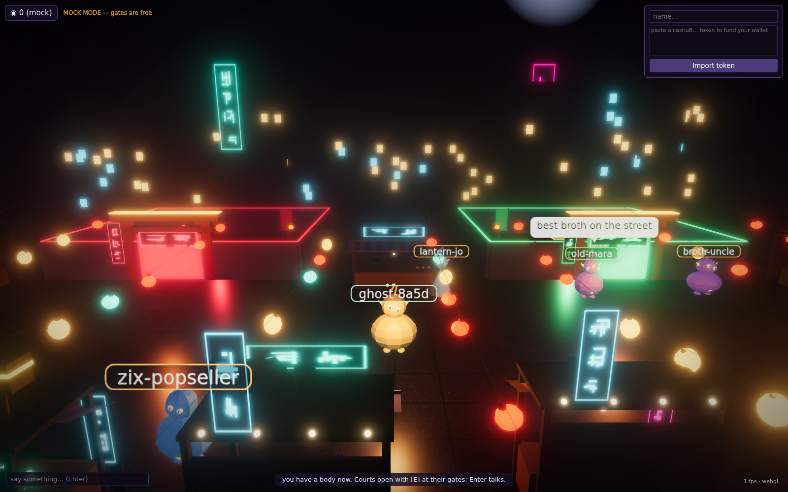

# Night Bazaar

> **Status & build note.** A working demo on the pops/cashu accept-layer stack:
> pay pops at a gate, win ecash. The server depends on
> [`MakePrisms/pops`](https://github.com/MakePrisms/pops) (the `pops-core-verify`
> middleware and charge-01 codec); clone it and point the build at it (see Run).

A pop-gated 3D browser world. Arrive as a ghost, pay a pops token to spawn a body, pay again to enter gated courts, win real ecash at the booths inside.



## How it works

**Core loop:** anyone connects as a ghost and roams free. A small pops payment spawns a body (chat, jump, interact). Deeper courts and booths require a second payment at the door. Winning plays pay out real ecash bearer tokens.

**Architecture:** one Rust axum binary serves the game websocket (server-authoritative positions, per-session entitlements, chat relay), the pops-gated HTTP 402 endpoints (`POST /spawn`, `POST /enter/:court`, `POST /play/gacha`, `POST /play/bell`), and the built Three.js client. Payments are verified by `pops-core-verify` (MakePrisms/pops). The server accepts the full set of currently-valid `pop_<ts>` units (multi-unit accept with auto-rotation); a durable revenue sink (`vault/revenue.jsonl`) is written and fsynced before every grant returns.

**Booths:**
- **Riddle lantern** (jade court, free): answer the riddle, win a prize, riddle rotates.
- **Gacha shrine** (crimson court, paid per pull): deterministic every-Nth-wins counter.
- **Timing bell** (street, paid per play): server-clock-judged pendulum, press `[E]` on cue.

## Controls

`WASD` move, `[B]` buy a body, `[E]` interact/pay/play, `[Space]` jump, `Enter`/`T` chat (bodies only), `[M]` mute.

At a booth: `[E]` reads the riddle / pulls the gacha / starts the bell; during a bell play `[E]` rings it; in the riddle modal type your answer and press Enter.

Dev query params: `?webgl=1` force WebGL2 (default tries WebGPU, auto-fallback), `?nobloom=1` skip the post chain, `?crowd=N` client-side fake wanderers for screenshots/FPS (never networked).

## Layout

- `server/` - Rust crate (`night-bazaar-server` binary + lib + `gen-vectors` helper)
- `client/` - bun + Three.js; charge-01 payer codec in `client/src/charge01.ts`
- `fetch-with-pop/` - the client's payment layer: a runtime-agnostic fetch wrapper that auto-pays HTTP 402 cashu challenges (`createCashuPopWallet`), consumed from source by the client
- `protocol/` - seam: `protocol.ts` (TS source of truth, mirrored by `server/src/protocol.rs`), shared fixtures, golden charge-01 vectors (both test suites consume them)
- `vault/tokens.json` - prize stock, keyed by chest/booth id (bearer cash, never commit)
- `vault/revenue.jsonl` - durable revenue sink (a WALLET, never commit): one line per redeemed gate/play, written and fsynced before the grant returns
- `.local/` - test funds and run artifacts (never commit)

## Run

**Prerequisites:** [`nix`](https://nixos.org) with flakes (the server builds inside the pops devshell), [`bun`](https://bun.sh) (the client), and Docker (only for the deploy image). No system Rust or Node needed: the devshell brings rustc, and the client is self-contained.

**Server** (from `server/`; the pops devshell provides rustc and the git dep):

```sh
# clone pops into the repo root so `../pops` resolves from server/:
git clone https://github.com/MakePrisms/pops
cd server
CARGO_NET_GIT_FETCH_WITH_CLI=true nix develop ../pops -c cargo run --bin night-bazaar-server
# two bins in this package; bare `cargo run` errors
# prebuilt: ./target/debug/night-bazaar-server
```

**Client** (from `client/`):

```sh
bun install
bun run build       # bundles src/main.ts + index.html into dist/
bun test            # codec vs golden vectors, wallet, protocol fixtures
```

**Server tests** (from `server/`):

```sh
CARGO_NET_GIT_FETCH_WITH_CLI=true nix develop <path-to-pops> -c cargo test
```

Everything is environment variables read at boot (`server/src/config.rs` is the source of truth). Every knob has a working local-dev default, so `cargo run` needs nothing set. **For a real `live` deploy the four that matter are** `BAZAAR_MODE=live`, `BAZAAR_MINT_URL`, `BAZAAR_MINT_PUBLIC_URLS` (so browsers see the right mint), and a persistent `BAZAAR_BINDING_KEY`. The rest is tuning.

**Core**

| Variable | Default | Purpose |
|---|---|---|
| `BAZAAR_MODE` | `live` | `live` enforces the pops 402 middleware; `mock` opens all gates (dev only) |
| `BAZAAR_BIND` | `0.0.0.0:8410` | Listen address (host:port) |
| `BAZAAR_MINT_URL` | `http://127.0.0.1:28338` | Cashu mint the server probes, redeems against, and proxies |
| `BAZAAR_MINT_PUBLIC_URLS` | = `BAZAAR_MINT_URL` | Comma-separated mint URLs as clients see them; first entry is the mint browsers build wallets on, the full list is the accepted-mint allowlist. Set it when the public mint URL differs from the server-side one |
| `BAZAAR_BINDING_KEY` | per-boot random | Hex secret binding payment challenges; unset means a restart invalidates outstanding challenges (clients refetch). Set a persistent value in production |

**Prices** (pops)

| Variable | Default | Purpose |
|---|---|---|
| `BAZAAR_PRICE_SPAWN` | `10` | Spawn a body |
| `BAZAAR_PRICE_JADE` | `50` | Enter the jade court |
| `BAZAAR_PRICE_CRIMSON` | `200` | Enter the crimson court |
| `BAZAAR_PRICE_GACHA` | `5` | One gacha pull |
| `BAZAAR_PRICE_BELL` | `3` | One bell play |
| `BAZAAR_GACHA_N` | `8` | Gacha pays out every Nth pull (deterministic, no RNG) |

**Paths**

| Variable | Default | Purpose |
|---|---|---|
| `BAZAAR_VAULT` | `../vault/tokens.json` | Prize tokens (bearer cashuB, keyed by chest/booth) |
| `BAZAAR_REVENUE_SINK` | `../vault/revenue.jsonl` | Append-only log of every redeemed proof. This file is a WALLET (bearer value): persist and back it up |
| `BAZAAR_STATIC` | `../client/dist` | Built client served at `/` |

**Tuning**

| Variable | Default | Purpose |
|---|---|---|
| `BAZAAR_SPEED` | `12.0` | Avatar walk speed (world units/sec, server-authoritative) |
| `BAZAAR_CHALLENGE_TTL_SECS` | `300` | How long a payment challenge stays valid |
| `BAZAAR_MINT_TIMEOUT_SECS` | `10` | Per-call mint HTTP timeout (503 beyond it) |
| `BAZAAR_UNIT_REFRESH_SECS` | `300` | How often the server re-probes the mint for new/expired `pop_<ts>` units (rotation pickup, no restart) |

## Deploy

Build artifacts, then deploy to Fly.io: see [`docs/fly-deploy.md`](docs/fly-deploy.md).

```sh
# POPS = path to your pops checkout; build-image.sh requires it
POPS=../pops bash server/build-image.sh   # release build + client build + staged runtime tree
docker build -t night-bazaar:latest .
fly deploy
```
